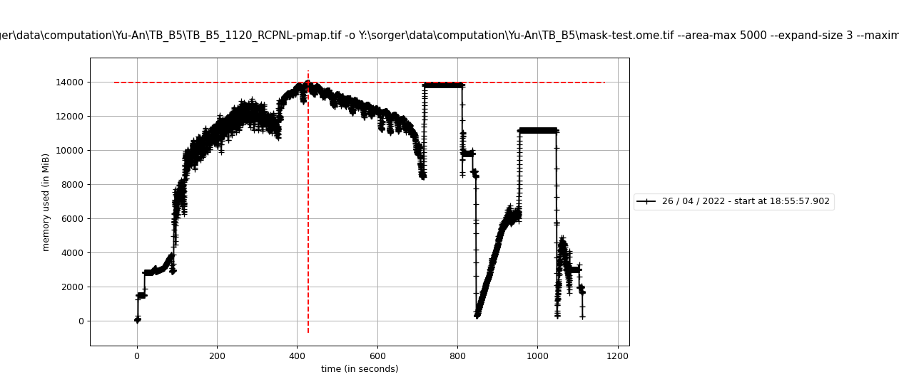
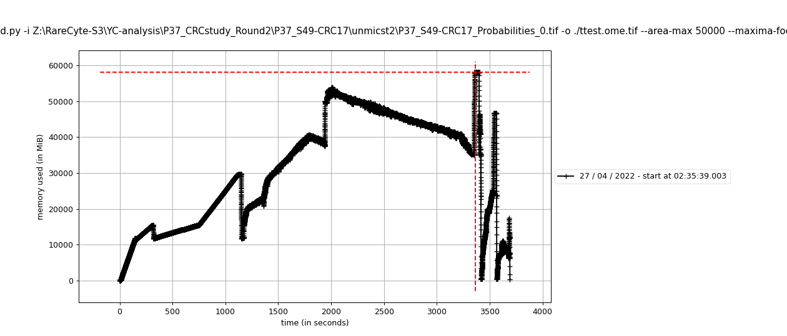

# install 
 
```bash 
conda create -n test-s3seg-dev numpy scikit-learn scikit-image matplotlib tifffile -c conda-forge 
conda activate test-s3seg-dev 
python -m pip install opencv-python ome_types imagecodecs dask-image zarr 
``` 
 
# Example 
 
## Test 1 (33045 x 42992 pixels, ~2.7 GB/channel)  
run script 
 
```bash 
python watershed.py -i "Y:\sorger\data\computation\Yu-An\TB_B5\TB_B5_1120_RCPNL-pmap.tif" -o "Y:\sorger\data\computation\Yu-An\TB_B5\mask-test.ome.tif" --area-max 5000 --expand-size 3 --maxima-footprint-size 5 --mean-intensity-min 80 
``` 
 
console log 
 
``` 
2022-04-26 18:56:00 | INFO     | Reading Y:\sorger\data\computation\Yu-An\TB_B5\TB_B5_1120_RCPNL-pmap.tif (watershed.py:381) 
2022-04-26 18:56:32 | INFO     | Probability map shape: (2, 33045, 42992) (watershed.py:383) 
2022-04-26 18:56:36 | INFO     | Run initiating (watershed.py:102) 
2022-04-26 18:56:36 | INFO     | Configuration: 
 
{'area_max': 5000, 
 'area_min': 10, 
 'footprint_size': 5, 
 'h': 0.01, 
 'mean_intensity_min': 80.0, 
 'overlap_size': 128, 
 'sigma': 1} 
 
 (watershed.py:103) 
2022-04-26 18:56:36 | INFO     | Start configuring `label` (watershed.py:196) 
2022-04-26 18:56:44 | INFO     | End configuring `label` (watershed.py:198) 
2022-04-26 18:56:45 | INFO     | Start configuring `label` (watershed.py:109) 
2022-04-26 18:57:25 | INFO     | End configuring `label` (watershed.py:111) 
[########################################] | 100% Completed | 10min 25.2s 
2022-04-26 19:07:53 | INFO     | Writing to Y:\sorger\data\computation\Yu-An\TB_B5\mask-test.ome.tif (watershed.py:127) 
2022-04-26 19:10:05 | INFO     | Expanding 3 pixels (watershed.py:404) 
2022-04-26 19:10:05 | INFO     | Writing to Y:\sorger\data\computation\Yu-An\TB_B5\mask-test-expanded_3.ome.tif (watershed.py:127) 
[########################################] | 100% Completed |  1min 45.3s 
[########################################] | 100% Completed | 30.4s 
2022-04-26 19:14:29 | INFO     | Done (watershed.py:407) 
``` 
 
memory profile 
 
 
 
## Test 2 (69414 x 86834 pixels, ~11.8 GB/channel)  
run script 
 
```bash 
python watershed.py -i "Z:\RareCyte-S3\YC-analysis\P37_CRCstudy_Round2\P37_S49-CRC17\unmicst2\P37_S49-CRC17_Probabilities_0.tif" -o ./ttest.ome.tif --area-max 50000 --maxima-footprint-size 5 --expand-size 3 
``` 
 
console log 
 
``` 
2022-04-27 02:35:49 | INFO     | Reading Z:\RareCyte-S3\YC-analysis\P37_CRCstudy_Round2\P37_S49-CRC17\unmicst2\P37_S49-CRC17_Probabilities_0.tif (watershed.py:381) 
2022-04-27 02:38:06 | INFO     | Probability map shape: (2, 69414, 86834) (watershed.py:383) 
2022-04-27 02:38:20 | INFO     | Run initiating (watershed.py:102) 
2022-04-27 02:38:20 | INFO     | Configuration: 
 
{'area_max': 50000, 
 'area_min': 10, 
 'footprint_size': 5, 
 'h': 0.01, 
 'mean_intensity_min': 128, 
 'overlap_size': 128, 
 'sigma': 1} 
 
 (watershed.py:103) 
2022-04-27 02:38:20 | INFO     | Start configuring `label` (watershed.py:196) 
2022-04-27 02:40:58 | INFO     | End configuring `label` (watershed.py:198) 
2022-04-27 02:40:59 | INFO     | Start configuring `label` (watershed.py:109) 
2022-04-27 02:54:53 | INFO     | End configuring `label` (watershed.py:111) 
[########################################] | 100% Completed | 36min 24.6s 
2022-04-27 03:31:28 | INFO     | Writing to ttest.ome.tif (watershed.py:127) 
2022-04-27 03:32:37 | INFO     | Expanding 3 pixels (watershed.py:404) 
2022-04-27 03:32:37 | INFO     | Writing to ttest-expanded_3.ome.tif (watershed.py:127) [########################################] | 100% Completed |  1min 51.8s 
[########################################] | 100% Completed |  1min 52.3s 
2022-04-27 03:37:10 | INFO     | Done (watershed.py:407) 
``` 
 
memory profile 
 
